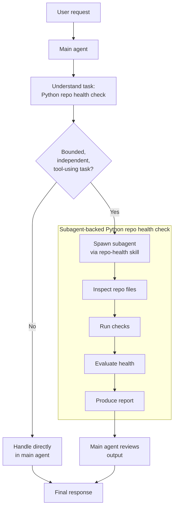

# Python Repo Health Check

Use this skill to inspect a Python repository and produce a short health report with clear pass/warn/fail calls.

This skill is intentionally subagent-backed. Keep the command execution and noisy tool output inside a worker subagent, then return only the synthesized report in the main thread.

## Workflow

1. Resolve the target repository path.
2. Read [references/health-criteria.md](references/health-criteria.md) and [references/report-template.md](references/report-template.md).
3. Confirm the repo looks like a Python project by checking for `pyproject.toml`. If it is missing, stop and say the skill does not apply.
4. Spawn a `worker` subagent with minimal context. Give it ownership of the health-check run for that repo path only. Tell it to avoid dumping full tool output and to summarize salient failures.
   - If the platform returns a friendly nickname for the worker, preserve it and use it in the final report label as `{friendly name}, the repo health checker`.
   - If subagents are unavailable, or `spawn_agent` cannot be used successfully, stop immediately. Do not run repo-health checks in the main thread.
5. Ask the worker to:
   - read `pyproject.toml`
   - inspect `uv.lock` if present
   - inspect CI/config files if present: `.github/workflows/`, `.gitlab-ci.yml`, `.pre-commit-config.yaml`, `pytest.ini`, `ruff.toml`, `ty.toml`
   - run `uv lock --check`
   - run `uv run ruff check .`
   - run `uv run pytest --collect-only`
   - run `uv run ty check`
   - if `uv` hits cache-permission, `.venv` lock, or similar environment noise, retry the runnable commands with `env UV_CACHE_DIR=/tmp/python-repo-health-uv-cache` and `uv run --no-sync ...`
   - capture exit status, short evidence snippets, and missing-tool/config cases
6. Review the worker result and write the final answer using the report shape from `references/report-template.md`.

## Worker Prompt Shape

Use a prompt close to this:

```text
Run a Python repo health check for /abs/path/to/repo.

Own only this repo-health task. You are not alone in the codebase; do not modify files and do not revert anything.

Do these steps:
1. Read pyproject.toml and summarize the packaging/tooling posture.
2. Inspect uv.lock and common CI/config files if present.
3. Run:
   - uv lock --check
   - uv run ruff check .
   - uv run pytest --collect-only
   - uv run ty check
   If uv cache or environment-lock issues interfere with read-only assessment, retry the runnable commands with:
   - env UV_CACHE_DIR=/tmp/python-repo-health-uv-cache uv run --no-sync ruff check .
   - env UV_CACHE_DIR=/tmp/python-repo-health-uv-cache uv run --no-sync pytest --collect-only
   - env UV_CACHE_DIR=/tmp/python-repo-health-uv-cache uv run --no-sync ty check
4. Do not paste long outputs. For each command, keep only exit code and the shortest useful evidence.
5. Return:
   - repo summary
   - check results table
   - health findings for deps, lockfile, coverage, typing, CI
   - top fixes
   - open questions / missing signals
```

Keep `fork_context` false unless the current thread already contains repo-specific policy that the worker needs.

## Subagent Requirement

This skill must run through a `worker` subagent.

Required behavior:

1. Spawn a `worker` subagent before running any repo-health commands.
2. Delegate all repo inspection and command execution to that worker.
3. Keep raw command output inside the worker.
4. Return only the synthesized report in the main thread.

If subagents are unavailable, fail closed with this exact message:

`This skill requires subagent support. Repo health checks were not run.`

## Interpretation Rules

- Treat this as a repo-health review, not a style critique.
- Distinguish between:
  - `pass`: the repo clearly meets the expectation
  - `warn`: the signal is missing, partial, or inconsistent
  - `fail`: the check ran and failed, or the repo clearly violates the expected posture
- Prefer evidence from config and command exit codes over guesswork.
- If a tool is not installed or not configured, say that plainly. Do not pretend the command result means source code quality is bad; report it as a tooling/config gap.
- If `uv` itself crashes or hits OS/sandbox-specific behavior, treat that as an environment blocker unless you have repo-specific evidence that the lockfile or config is broken.
- If `uv.lock` exists, `uv lock --check` is a hard signal. If the repo is clearly uv-based but no lockfile exists, call that out.
- `pytest --collect-only` is a structure check, not a correctness check. Treat successful collection as "tests are discoverable", not "tests pass".
- Coverage is healthy only when there is an explicit floor or enforcement path. Absence of a defined floor is a warning even if tests exist.
- Type-check posture is healthy only when the repo has an explicit stance: `ty` wired in config and/or CI, or a documented reason it is intentionally absent. Silent absence is a warning.
- CI is healthy when the automation matches the local stack closely enough that developers and CI are checking the same things.

## Execution Label

- If `spawn_agent` returns a nickname such as `Dalton`, refer to the worker in the final report as `Dalton, the repo health checker`.
- If no nickname is available, use `worker subagent, the repo health checker`.
- Treat this as a presentation rule only. Do not claim you can set the platform nickname from the skill.

## Output Constraints

- Keep the final report to roughly one page.
- Lead with the overall status and the few highest-leverage findings.
- Do not dump full command logs in the main thread.
- Include exact file names when citing config gaps.
- Include exact commands only when they materially help the user act.
- Add a short execution line near the top of the report:
  - `Execution mode: Dalton, the repo health checker`
  - or `Execution mode: worker subagent, the repo health checker`
 
## Health Report generation process


